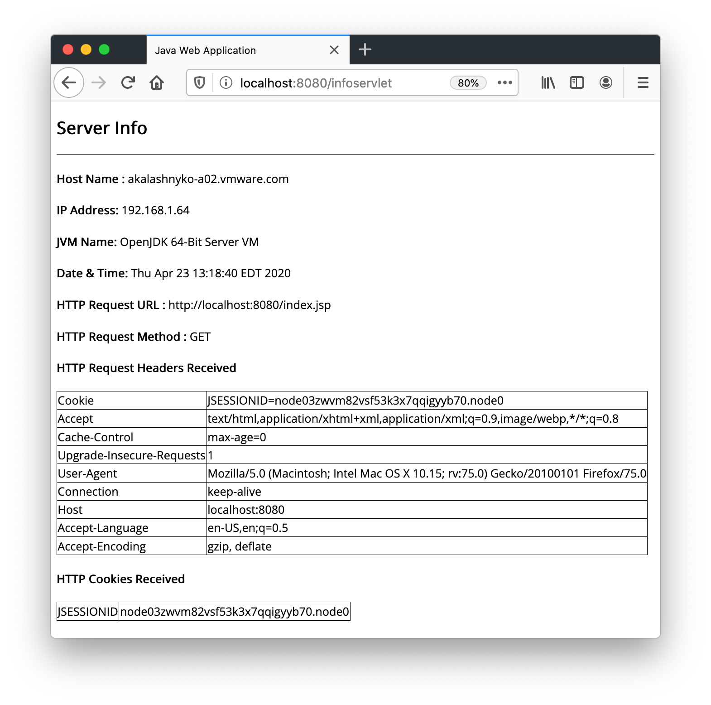
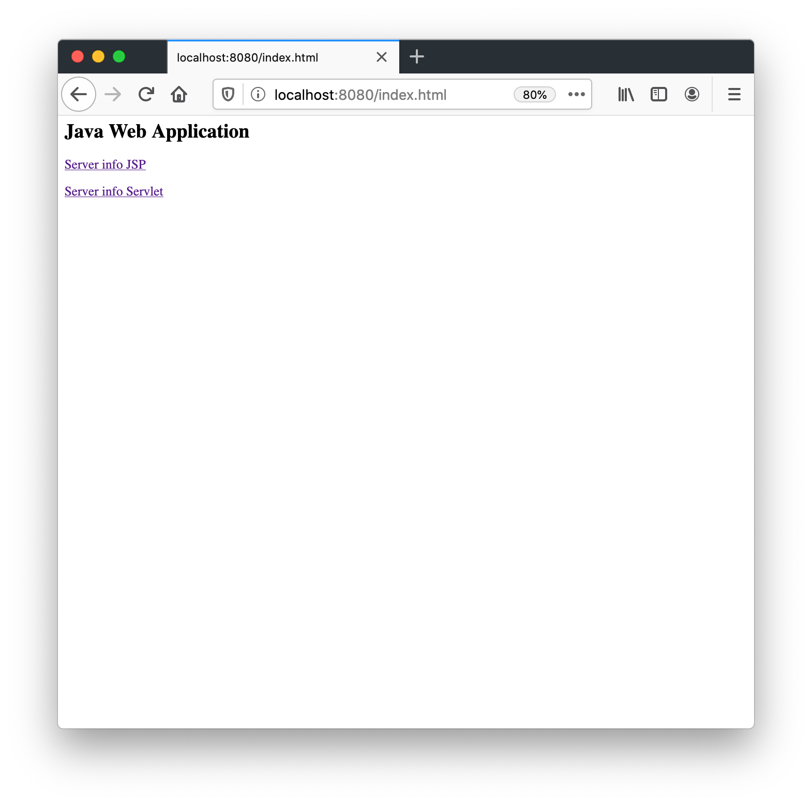

[](https://sonarqube.aws-ss.nsf.gov/dashboard?id=com.sample-java-app%3Atomcat-root-war)
[](https://opensource.org/licenses/MIT)


ROOT.war replaces Tomcat's default ROOT application - $TOMCAT_HOME/webapps/ROOT

## Pre-requisites

* [sdkman](https://sdkman.io/install)

    Install and use JDK 18

    ```bash
    sdk install java 18.0.2-tem
    sdk use java 18.0.2-tem
    ```
* [Apache Maven](https://maven.apache.org/install.html)

  Install Apache Maven 3.9.0

    ```bash
    sdk install maven 3.9.0
    sdk use maven 3.9.0
    ```
* [git](https://git-scm.com/book/en/v2/Getting-Started-Installing-Git)

## Test with Jetty web server

```shell
git clone git@github.com:AndriyKalashnykov/tomcat-root-war.git
cd tomcat-root-war
mvn clean package jetty:run

xdg-open http://localhost:8080/index.html
```

Access http://localhost:8080/index.html or see [Tomcat ROOT WAR Web Application UI](https://github.com/AndriyKalashnykov/tomcat-root-war/blob/master/README.md#java-web-application-ui)

## Create WAR file

```shell
git clone git@github.com:AndriyKalashnykov/tomcat-root-war.git
cd tomcat-root-war
mvn clean install
```

## List content of generated WAR file

```shell
jar tf ./target/ROOT.war
```
## Replace TOMCAT ROOT application

Edit `$TOMCAT_HOME/conf/server.xml`: `autoDeploy` and `deployOnStartUp` needs to be set to `false`

```xml
<Host name="localhost"  appBase="webapps" unpackWARs="true" autoDeploy="false" deployOnStartUp="false">
```

Remove default ROOT folder and copy ROOT.war
```shell
rm -rf $TOMCAT_HOME/webapps/ROOT/
rm -f $TOMCAT_HOME/webapps/ROOT.war
cp ./target/ROOT.war $TOMCAT_HOME/webapps/ROOT.war
```

### Tomcat ROOT WAR Web Application UI

Default welcome page -  [http://localhost:8080/](http://localhost:8080/)


JSP - [http://localhost:8080/index.jsp](http://localhost:8080/index.jsp)


Servlet - [http://localhost:8080/infoservlet](http://localhost:8080/infoservlet)


HTML - [http://localhost:8080/index.html](http://localhost:8080/index.html)

